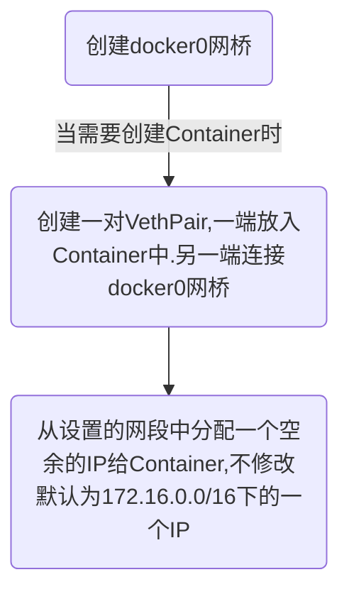

# Docker 网络

[TOC]

## Docker创建网络过程




## 实验

### 创建两个Container,并让他们夯在前台

```shel
[root@docker ~]# docker run --rm -ti --name test-1 busybox
#
[root@docker ~]# docker run --rm -ti --name test-2 busybox
#
```

### 查看网络

```shell
[root@docker ~]# ip link
1: lo: <LOOPBACK,UP,LOWER_UP> mtu 65536 qdisc noqueue state UNKNOWN mode DEFAULT group default qlen 1000
    link/loopback 00:00:00:00:00:00 brd 00:00:00:00:00:00
2: ens34: <BROADCAST,MULTICAST,UP,LOWER_UP> mtu 1500 qdisc pfifo_fast state UP mode DEFAULT group default qlen 1000
    link/ether 00:0c:29:ab:dd:ad brd ff:ff:ff:ff:ff:ff
3: docker0: <BROADCAST,MULTICAST,UP,LOWER_UP> mtu 1500 qdisc noqueue state UP mode DEFAULT group default 
    link/ether 02:42:f7:c6:2a:5f brd ff:ff:ff:ff:ff:ff
105: veth9520707@if104: <BROADCAST,MULTICAST,UP,LOWER_UP> mtu 1500 qdisc noqueue master docker0 state UP mode DEFAULT group default 
    link/ether 2a:03:54:d0:98:94 brd ff:ff:ff:ff:ff:ff link-netnsid 0
107: veth5c112f6@if106: <BROADCAST,MULTICAST,UP,LOWER_UP> mtu 1500 qdisc noqueue master docker0 state UP mode DEFAULT group default 
    link/ether 32:6f:18:c0:5b:5d brd ff:ff:ff:ff:ff:ff link-netnsid 1
```

> 多出两个`veth`设备,可以看出他们隶属于docker0,可以通过brctl查看

```shell
[root@docker ~]# brctl show
bridge name	bridge id		STP enabled	interfaces
docker0		8000.0242f7c62a5f	no		veth5c112f6
						            	veth9520707
```

> 可以看到这两个Veth设备连接在docker0网桥下

```shell
 [root@docker ~]# docker inspect test-1
.......
 "Networks": {
                "bridge": {
                    "IPAMConfig": null,
                    "Links": null,
                    "Aliases": null,
                    "NetworkID": "386a6f14c9fbf118848ee64193b39bac6791eb63f65d1634affacb5b70d1ac40",
                    "EndpointID": "927f0b2a93cc5f8283e996f80d16e9acf170e878e67284ee63d28345828f3a9e",
                    "Gateway": "192.168.99.1",
                    "IPAddress": "192.168.99.2",
                    "IPPrefixLen": 24,
                    "IPv6Gateway": "",
                    "GlobalIPv6Address": "",
                    "GlobalIPv6PrefixLen": 0,
                    "MacAddress": "02:42:c0:a8:63:02",
                    "DriverOpts": null
                }
....
 [root@docker ~]# docker inspect test-2
 .....
"Networks": {
                "bridge": {
                    "IPAMConfig": null,
                    "Links": null,
                    "Aliases": null,
                    "NetworkID": "386a6f14c9fbf118848ee64193b39bac6791eb63f65d1634affacb5b70d1ac40",
                    "EndpointID": "9de946b49f8e6f70172871c42f68701597379e77425a0297ca96c7d0ad0ad1b9",
                    "Gateway": "192.168.99.1",
                    "IPAddress": "192.168.99.3",
                    "IPPrefixLen": 24,
                    "IPv6Gateway": "",
                    "GlobalIPv6Address": "",
                    "GlobalIPv6PrefixLen": 0,
                    "MacAddress": "02:42:c0:a8:63:03",
                    "DriverOpts": null
                }
....
```

> 可以看到,它们都在`192.168.99.0/24`网段下,网关为`192.168.99.1`,这个网关为LinuxBridege的地址
>
> 这个网段是我自己设置的,默认网段为`172.16.0.0/16`,默认网段为`172.16.0.1`

### Port的对外暴露

> 在使用`Docker`时,经常会对Container的`Port`进行映射,将Container的`Port`映射到主机上的Port上,`Docker`是通过`iptables`来进行实现的

#### 创建一个nginx Container

```shell
[root@docker ~]# docker run --rm -d -p 88:80 --name nginx_test nginx
a46b5db96aff930f1e83b575b06953f888a296890af4a31499aa15efe888d495
```

#### 验证是否映射成功

```shell
[root@docker ~]# curl localhost:88
<!DOCTYPE html>
<html>
<head>
<title>Welcome to nginx!</title>
<style>
    body {
        width: 35em;
        margin: 0 auto;
        font-family: Tahoma, Verdana, Arial, sans-serif;
    }
</style>
</head>
<body>
<h1>Welcome to nginx!</h1>
<p>If you see this page, the nginx web server is successfully installed and
working. Further configuration is required.</p>

<p>For online documentation and support please refer to
<a href="http://nginx.org/">nginx.org</a>.<br/>
Commercial support is available at
<a href="http://nginx.com/">nginx.com</a>.</p>

<p><em>Thank you for using nginx.</em></p>
</body>
</html>
```

#### 查看iptables规则

```shell
[root@docker ~]# iptables-save 
# Generated by iptables-save v1.4.21 on Sat May  8 13:56:06 2021
*filter
:INPUT ACCEPT [295:20759]
:FORWARD DROP [0:0]
:OUTPUT ACCEPT [190:29508]
:DOCKER - [0:0]
:DOCKER-ISOLATION-STAGE-1 - [0:0]
:DOCKER-ISOLATION-STAGE-2 - [0:0]
:DOCKER-USER - [0:0]
-A FORWARD -j DOCKER-USER
-A FORWARD -j DOCKER-ISOLATION-STAGE-1
-A FORWARD -o docker0 -m conntrack --ctstate RELATED,ESTABLISHED -j ACCEPT
-A FORWARD -o docker0 -j DOCKER
-A FORWARD -i docker0 ! -o docker0 -j ACCEPT
-A FORWARD -i docker0 -o docker0 -j ACCEPT
-A DOCKER -d 192.168.99.2/32 ! -i docker0 -o docker0 -p tcp -m tcp --dport 80 -j ACCEPT
-A DOCKER-ISOLATION-STAGE-1 -i docker0 ! -o docker0 -j DOCKER-ISOLATION-STAGE-2
-A DOCKER-ISOLATION-STAGE-1 -j RETURN
-A DOCKER-ISOLATION-STAGE-2 -o docker0 -j DROP
-A DOCKER-ISOLATION-STAGE-2 -j RETURN
-A DOCKER-USER -j RETURN
COMMIT
# Completed on Sat May  8 13:56:06 2021
# Generated by iptables-save v1.4.21 on Sat May  8 13:56:06 2021
*nat
:PREROUTING ACCEPT [0:0]
:INPUT ACCEPT [0:0]
:OUTPUT ACCEPT [2:120]
:POSTROUTING ACCEPT [2:120]
:DOCKER - [0:0]
-A PREROUTING -m addrtype --dst-type LOCAL -j DOCKER
-A OUTPUT ! -d 127.0.0.0/8 -m addrtype --dst-type LOCAL -j DOCKER
-A POSTROUTING -s 192.168.99.0/24 ! -o docker0 -j MASQUERADE
-A POSTROUTING -s 192.168.99.2/32 -d 192.168.99.2/32 -p tcp -m tcp --dport 80 -j MASQUERADE
-A DOCKER -i docker0 -j RETURN
-A DOCKER ! -i docker0 -p tcp -m tcp --dport 88 -j DNAT --to-destination 192.168.99.2:80
COMMIT
# Completed on Sat May  8 13:56:06 2021
```

> 里面有许多iptables规则,其中有一条是这样的:
>
> ```shell
> [root@docker ~]# iptables-save |grep 88
> -A DOCKER ! -i docker0 -p tcp -m tcp --dport 88 -j DNAT --to-destination 192.168.99.2:80
> ```
>
> 这条就是实现port暴露的关键
>
> 这些规则有许多可以规则:
>
> ```shell
> -A POSTROUTING -s 192.168.99.0/24 ! -o docker0 -j MASQUERADE
> ```
>
> 将`192.168.99.0/24`进行地址伪装

### 查看路由信息

> 宿主机与Container之间通信,是通过路由直接进行通信的
>
> ```shell
> [root@docker ~]# route -n
> Kernel IP routing table
> Destination     Gateway         Genmask         Flags Metric Ref    Use Iface
> 0.0.0.0         10.0.0.2        0.0.0.0         UG    100    0        0 ens34
> 10.0.0.0        0.0.0.0         255.255.255.0   U     100    0        0 ens34
> 192.168.99.0    0.0.0.0         255.255.255.0   U     0      0        0 docker0
> ```