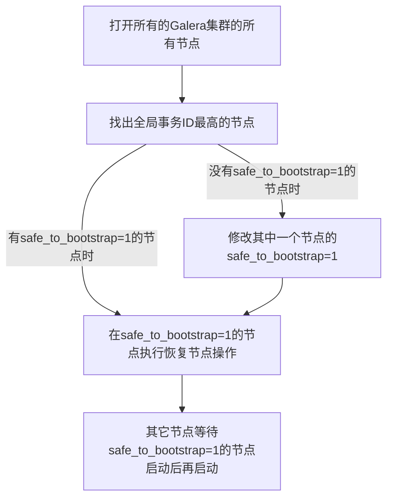

# Galera集群故障恢复

[TOC]

**以下所说的参数在`/var/lib/mysql/grastate.dat `下**

```shell
# GALERA saved state
version: 2.1
uuid:    9b24fbb9-9d80-11eb-ba5d-ce1c0092c298   #集群的UUID
seqno:   -1            #如果集群所有节点的数据相差不大,该数值的大小应该都一样
safe_to_bootstrap: 0  #当集群正常退出,最后一个退出的节点,这个参数将为1,将使用这个节点引导整个集群
```




## 找出safe_to_bootstrap=1的节点

```shell
cat /var/lib/mysql/grastate.dat
```

## 首先启动safe_to_bootstrap=1的节点

```shell
systemctl stop mysqld
mysqld --wsrep-recover   #恢复集群
/usr/bin/mysqld_bootstrap #启动集群
```

## 依次开启其它节点

```shell
systemctl restart mysqld
```

## 写脚本,来对这一过程进行自动化

```shell
cat > ~/start_galera_mysql.sh <<EOF
#!/bin/bash
gtid=\`cat /var/lib/mysql/grastate.dat | grep -E "^\s*safe_to_bootstrap:" | awk '{print \$2}'\`
if [[ \$gtid == "1" ]]; then
   systemctl stop mysqld
   mysqld --wsrep-recover
   /usr/bin/mysqld_bootstrap
else
   while ! systemctl status mysqld; do
      systemctl start mysqld
   done
fi
EOF
chmod +x ~/start_galera_mysql.sh
echo 'bash /root/start_galera_mysql.sh' >> /etc/rc.d/rc.local
chmod +x /etc/rc.d/rc.local
```

