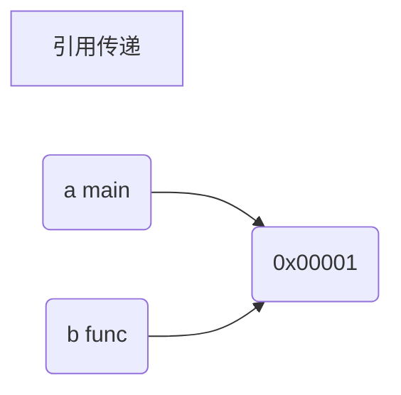
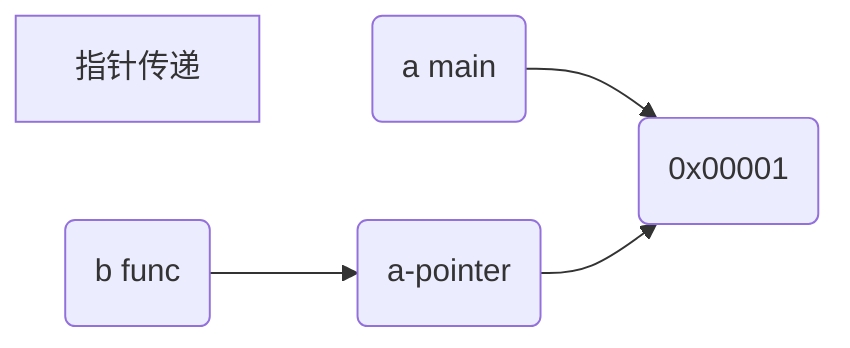

> `a`: 在`main`函数中的变量
>
> `b`:在`main`中调用函数的参数,与`a`是相同类型
>
> 引用传递是将变量的地址在函数中间传递,形参与主函数的地址是相同的

> `a`: 在`main`函数中的变量
>
> `b`:在`main`中调用函数的参数,是`a`的指针类型,他的地址中是一个指向`a`的指针
>
> 指针传递与引用传递的区别为：引用传递的形参的变量类型与实参的类型一致，形参与实参同时指向同一变量，指针传递的形参类型为实参类型的指针类型，它是通过一个指针指向变量的，而不是直接指向变量

