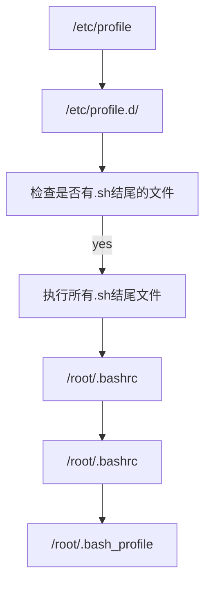

# Linux登录执行脚本顺序




## 验证

```shell
[root@cq7-244 ~]# echo "echo /etc/profile" >>/etc/profile
[root@cq7-244 ~]# echo "echo /etc/bashrc" >>/etc/bashrc
[root@cq7-244 ~]# echo "echo /root/.bashrc" >>/root/.bashrc
[root@cq7-244 ~]# echo "echo /root/.bash_profile" >>/root/.bash_profile
```

> 将这些内容写入各个文件,再次登录会显示这些信息,可以看出顺序

```shell
WARNING! The remote SSH server rejected X11 forwarding request.
Last login: Thu Sep  9 16:44:03 2021 from 192.168.2.23
/etc/profile
/etc/bashrc
/root/.bashrc
/root/.bash_profile
```

