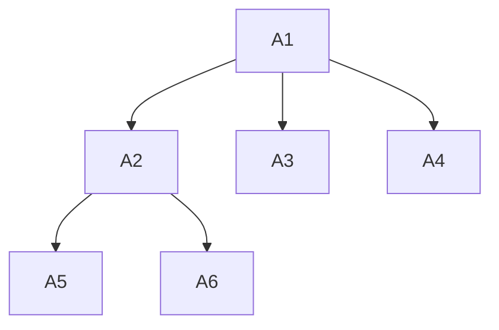
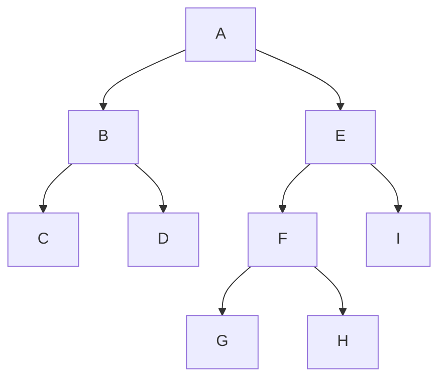

# 树

[TOC]

### 树的节点

> 上面这些,A1~A6都是这个树的节点

### 节点的度

> 节点所引出的分支的个数,按照以上那棵树来说,A1的度为3,A2的度为2,A3~6的度为0

### 树的度

> 树的度指其中节点的度最大值,上面那棵树的度为3,因为上面的那棵树的度最大的节点的为3

### 叶子节点

> 也叫终端结点，是度为 0 的结点,也就是上图那棵树的A3~A6

### 孩子节点和双亲节点

> 按照上图的树来说:
>
> A1是A2~4的双亲节点
>
> A2~A4是A1的孩子节点
>
> A2是A5,A6的双亲节点
>
> A5,6是A2的孩子节点

## 二叉树的一些性质

>  **1. n0 = n2 + 1**
>
> 总结点数 =n0 + n1 + n2 (度为0、1、2的结点数之和)
>
> 总结点数 = n1 + 2n2 + 1 （度为1、2的结点的分支+根节点）
>
> 相减得：n0 = n2 + 1
>
>  **2. 包含n个结点的二叉树的高度至少为log2(n+1)**
>
> **3.总分支数=总节点数-1**
>
> **4.叶子节点=双分支节点+1**

> 前序: ABCDEFGHI  (根左右)
>
> 中序:CBDAGFHEI(左根右)
>
> 后续: CDBGHFIEA(左右根)

按照我的理解,就是相当于遍历,比如说根左右,先遍历根,然后遍历左节点,然后再将做孩子节点作为根节点,进行根左右的遍历,一直这样下去
